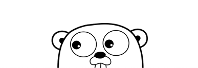
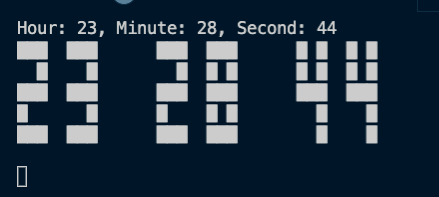

# Retro-Clock


## **Written in GO!**

Go! An open source programming language to make more programmers more productive, created by Google

## What is Go?
* Go, or Golang, was made to combine the ease of programming of an interepreted, dynamic typed language with the efficiency and safety of a statically typed, compiled langauage

### What does this program do?
* This program when executed displays a running clock using ascii code characters. This clock automatically updates every second, and every other second the colons between the numbers disappears and reappears. 

### How to run this program
```go
go run main.go
```  
